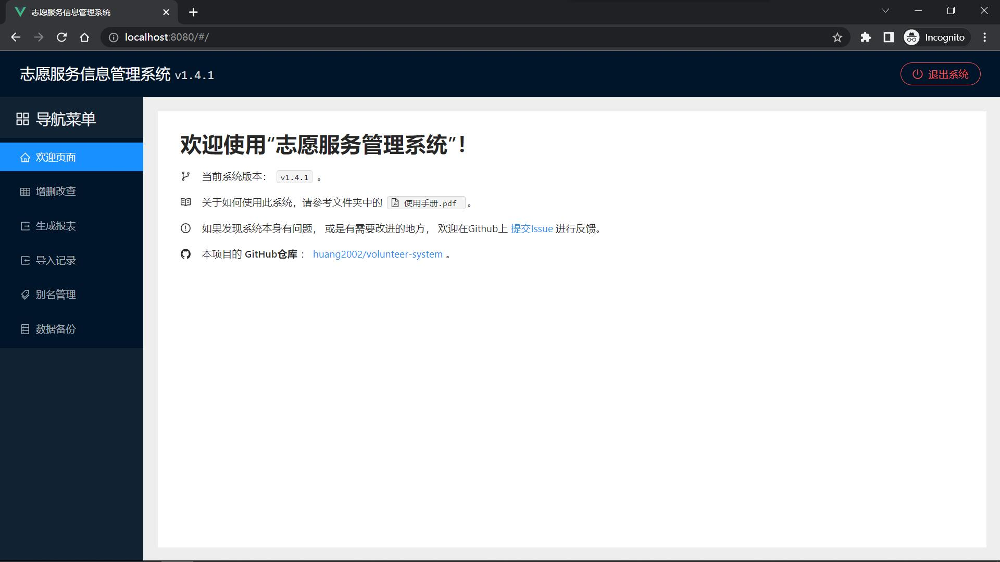

# 志愿服务信息管理系统

一款个人开发的免费、开源软件，用于录入、保存、整理和统计志愿服务信息。

- 开源证书：[MIT License](./LICENSE)
- 版本发布：[GitHub Releases](https://github.com/huang2002/volunteer-system/releases)
- 问题反馈：[GitHub Issues](https://github.com/huang2002/volunteer-system/issues)
